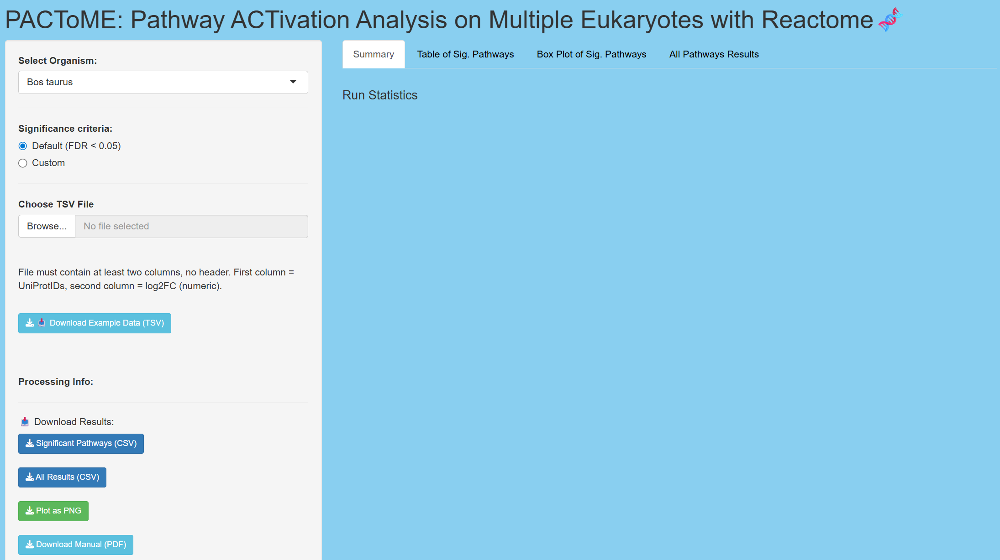

Pathway ACTivation Analysis on Multiple Eukaryotes (PACToME) using Reactome is an interactive R shiny application that extends pathway activation to the entire 
eukaryotic research community using the expansive pathway level information from the Reactome Knowledgebase. 

PACToME is an extension to an existing pathway activation analysis (PAA) toolkit available through the Dartmouth Cystic Fibrosis Research Center (DartCF)
Bioinformatics and Biostatistics Research Core on their Data Reuse and Analysis Applications website. This site includes a variety of accessible, user-friendly tools  
to analyze gene expression data as well as tools with pre-loaded databases for cystic fibrosis, pathogenic bacteria, as well as NCBI Gene Expression Omnibus (GEO). 

Once available, PACTOME can be accessed via this repository or via the research core's website:  
https://sites.dartmouth.edu/dartcf/research-cores/p30/cf-bioinformatics-biostatistics-core-p30/data-reuse-and-analysis-applications/

** Note: This file will be updated once PACToME is live on the DartCF's Core website. For now, please downloaded the necessary files from this repository.**

Users will select one of the 14 available species from the Reactome Knowledgebase, upload a two-column TSV file of UniProt IDs and log2FoldChange values, and choose
significance criterion for the analysis (default or custom thresholds based on the user's research question). PACToME interactively outputs summary statistics based 
on user's input file, produces detailed tables of significant pathways as well as all pathways analyzed, and a boxplot of up to ten pathways sorted by FDR values. 
Result tables (significant and all) can be downloaded as CSV files, the boxplot as a PNG, and the user manual as a PDF. 

Example data is also available and can be used to showcase how the application works and be used as a template. 

All files included here are necessary for the proper function of PACToME. 

To run PACToME locally, place all required files in the same directory and run "shiny::runApp()."

